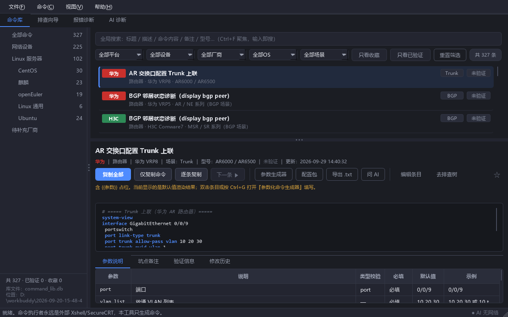
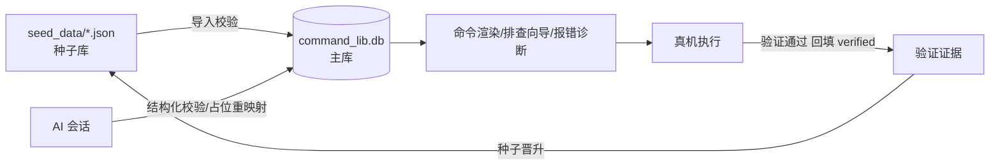

# NetToolBox —— 离网网络运维工具箱：命令库 × 排查树 × 报错诊断，专为客户现场「无网可用」而生。

<!-- 截图占位：截图文件请放入 docs/screenshots/ 后替换下行 -->


一套面向网络工程师与交付工程师的桌面工具（PyQt5），把各家厂商设备的常用命令、排查思路、报错判读沉淀成**可检索、可渲染、可验证**的本地知识库——不联网、不依赖云服务，拷进 U 盘就能带去机房。

## 功能特性

- **三库联动**
  - **命令库**：按「厂商 → OS → 场景」组织的命令条目，`{{参数}}` 占位渲染、必填/选填校验、一键复制；
  - **报错诊断**：把设备真实报错回显粘贴进来，匹配报错字典直接给出原因与处理步骤；
  - **排查树向导**：按故障场景（接口抖动、广播风暴、升级回滚、AAA 锁死……）逐步引导，步骤内引用命令库条目。
- **AI 会话入库管线**：与 AI 对话生成的命令/排查树，经结构化校验后一键入库，占位 id 自动重映射，杜绝「复制粘贴进文档再手工整理」。
- **真机验证流转**：每条命令带 `verified` 状态与验证人/型号/日期字段，未验证条目明确标黄；真机验证通过后回填晋升，种子库只进「可信命令」。
- **离网可用**：零联网运行，SQLite 主库 + JSON 种子全本地；附 `check_db.py` 只读体检工具，U 盘/受限环境可直接跑。

## 架构与数据流



种子是唯一事实源：改种子 → `--validate-seed` 全量校验 → 重建/更新主库；真机验证结论回流种子，形成「沉淀 → 验证 → 晋升」闭环。

## 快速开始

**方式一：下载成品（推荐，免装环境）**

到 [Releases](../../releases) 下载 `NetToolBox-dist-*.zip`，解压即用：

```
NetToolBox.exe        # 双击运行
command_lib.db        # 命令主库
check_db.py           # 只读体检脚本（可选）
```

**方式二：源码运行**

```bash
pip install -r requirements.txt   # PyQt5 + requests（离网机器可用 dist zip 内的 _vendor）
python app/main.py                # 启动 GUI
python app/main.py --validate-seed   # 种子库质检（改种子后必跑）
python scripts/check_db.py        # 主库只读体检
```

## 种子规模

| 库 | 数量 |
|---|---|
| 命令条目 | **327** |
| 排查树 | **26** 棵（防火墙 / Linux / 网络 / 运维） |
| 报错字典 | **82** 条 |

覆盖 **11 家网络厂商**（Cisco、华为 AR/S、H3C、Juniper、PaloAlto、Fortinet、锐捷、中兴、深信服、天融信）+ **Linux ×4**（CentOS 7 / 麒麟 V10 / openEuler 22.03 / Ubuntu 22.04），另有 8 家厂商占位目录持续扩充中。

## 目录结构

```
app/            PyQt5 应用（入口 app/main.py）+ seed_data/ 种子库
scripts/        校验、体检与维护脚本（check_db / backup_db / hooks / build_exe 一键打包）
docs/           审计报告、部署说明、dev-notes、prompts 归档、screenshots 截图
.github/        CI（validate-seed）
```

> 打包说明：`python scripts/build_exe.py`（PyQt5 + PyInstaller）；requests 依赖以 `pip --target` 落在 `_vendor/`（仅构建机本地，随 exe 打包、不入 git）。AI 会话产物落位规范见 [AGENTS.md](AGENTS.md)。

## 贡献指引

1. **修改 `app/seed_data/` 的 PR 必须通过 CI 的 `validate-seed`**（参数占位一致性、UUID 唯一、slug 规范、样例自测全绿才能合入）。
2. 本地建议装 pre-commit 钩子，提交前自动质检：

   ```bash
   cp scripts/hooks/pre-commit .git/hooks/pre-commit && chmod +x .git/hooks/pre-commit   # Windows Git Bash 免 chmod
   ```

3. 新增命令请带 `notes`（坑点/判读口径/验证方法），未真机验证的条目保持 `verified: 0`。

## 免责声明

- 各厂商 CLI 语法与输出格式**版权归原厂商所有**，本项目仅收录运维场景常用示例并标注出处语义；
- 命令随版本变化，执行前请以目标设备 `?` 实测为准；
- **生产环境务必先在模拟器/测试环境验证**，涉及 `reload`/`reboot`/配置替换类命令必须遵守变更窗口 + 回滚点 + 带外通道三要素；
- 本项目按「现状」提供，使用者需自行承担现场执行风险。

## License

[MIT](LICENSE)
